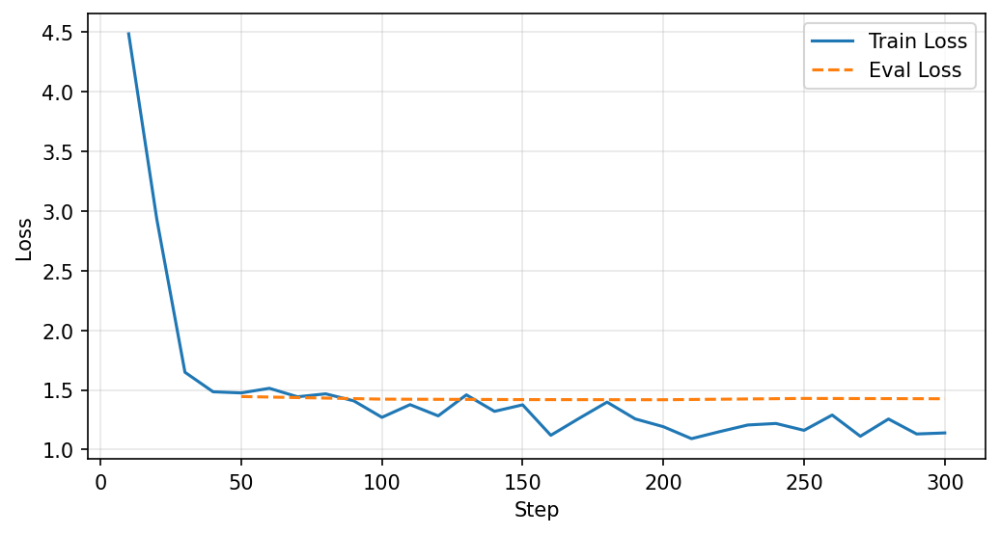
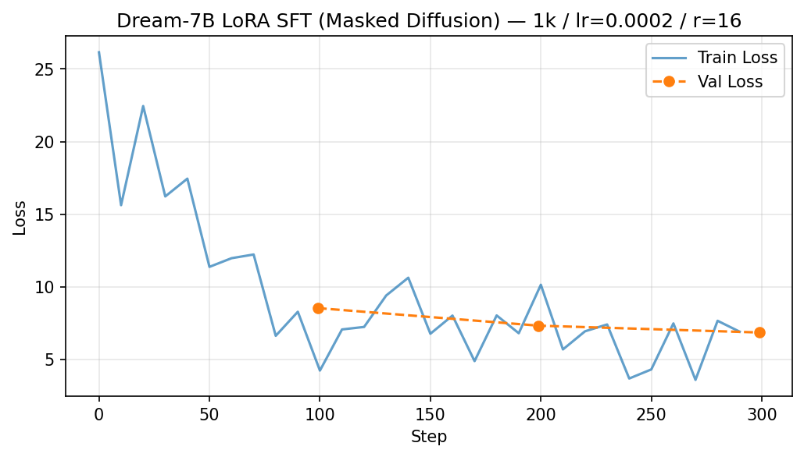

# Xenolinguistics: Dream-7B vs Qwen2.5-7B LoRA Fine-Tuning

> Diffusion LLM(Dream-7B)과 Autoregressive LLM(Qwen2.5-7B)의 LoRA SFT 가능성을 EN→FI 번역 태스크로 비교 검증한 실험 보고서.

---

## 1. 실험 목적

핀란드어(Finnish)는 교착어로 15개 격변화를 가지며, 인공어(퀘냐, 클링온 등) 실험의 파이프라인 검증에 적합하다. 본 실험은 다음을 검증한다:

1. **Diffusion LLM에 LoRA SFT가 가능한가?**
2. **AR LLM 대비 번역 품질은 어떠한가?**
3. **단일 Python 환경에서 두 모델을 동시에 운영할 수 있는가?**

## 2. 실험 환경

| 항목 | 값 |
|------|-----|
| GPU | NVIDIA RTX PRO 6000 Blackwell (98GB VRAM) |
| PyTorch | 2.10.0+cu128 |
| Transformers | 4.46.2 (Dream 호환 버전) |
| PEFT | 0.19.1 |
| TRL | 1.3.0 |
| 데이터셋 | Helsinki-NLP/opus-100 (en-fi) |

### 데이터셋 상세

| 분할 | 1k 셋 | 10k 셋 | 용도 |
|------|:------:|:------:|------|
| Train | 800문장 | 8,000문장 | Qwen (1k) / Dream (10k) |
| Validation | 100문장 | 1,000문장 | 학습 중 평가 |
| Test | 100문장 | 1,000문장 | 최종 chrF/BLEU 평가 (test_1k 100문장 사용) |

- **출처**: [Helsinki-NLP/opus-100](https://huggingface.co/datasets/Helsinki-NLP/opus-100) (en-fi 서브셋)
- **내용**: 영화 자막 및 EU 공식 문서의 영어-핀란드어 병렬 코퍼스
- **형식**: JSONL — `{"instruction": "Translate to Finnish: ...", "output": "핀란드어 번역", "en": "...", "fi": "..."}`
- **문장 예시**:

| EN (원문) | FI (정답) |
|-----------|-----------|
| He's your brother. | Sinun veljesi. |
| How do you do? | Hauska tutustua. |
| Oh, I must have her phone. | Tämän täytyy olla hänen puhelimensa. |

## 3. 모델 구성

| 역할 | 모델 | 방식 | 파라미터 |
|------|------|------|---------|
| **Reference NMT** | Helsinki-NLP/opus-mt-tc-big-en-fi | 전용 NMT, 학습 없음 | 237.7M |
| **AR LLM** | Qwen/Qwen2.5-7B-Instruct | LoRA r=16, causal LM SFT | 7.6B (trainable: 10M, 0.13%) |
| **Diffusion LLM** | Dream-org/Dream-v0-Instruct-7B | LoRA r=16, masked diffusion SFT | 7.6B (trainable: 10M, 0.13%) |

## 4. 학습 설정

| 항목 | Qwen2.5-7B (AR) | Dream-7B (Diffusion) |
|------|:---:|:---:|
| 데이터 | 1k (train 800 / val 100 / test 100) | 10k (train 8000 / val 1000 / test 1000) |
| Epochs | 3 | 3 |
| Batch size | 8 | 16 |
| Learning rate | 2e-4 (cosine) | 2e-4 (cosine) |
| 학습 시간 | **0.8분** | **7.3분** |
| Final train loss | 1.14 | 5.52 |
| Final eval loss | 1.43 | 5.25 |
| Format | Qwen ChatML (`<\|im_start\|>`) | Dream ChatML (`apply_chat_template`) |
| Masking 전략 | — | **Response-only** (assistant 토큰만 mask) |
| Mask ratio | — | Random 0.15~0.85 per batch |

### 학습 곡선

| Qwen Loss Curve | Dream Loss Curve |
|:---:|:---:|
|  |  |

## 5. 평가 결과

### 평가 지표 설명

| 지표 | 설명 | 범위 |
|------|------|------|
| **chrF** | Character F-score. 문자(character) n-gram 기반 유사도. 형태론이 복잡한 언어(핀란드어 등)에서 BLEU보다 신뢰도 높음. | 0~100 (높을수록 좋음) |
| **BLEU** | Bilingual Evaluation Understudy. 단어(word) n-gram 정밀도 기반. 기계번역의 전통적 표준 지표. 짧은 문장에서 변동 큼. | 0~100 (높을수록 좋음) |

### 정량 비교

| 모델 | 모드 | chrF | BLEU | 데이터 | 출력 품질 평가 |
|------|------|:----:|:----:|:------:|------|
| **opus-mt (Reference NMT)** | — | **56.91** | **37.45** | — | 자연스러운 핀란드어 문장 생성. 문법·어순 모두 정확하며 원어민 수준에 근접. 전용 NMT 모델로서 기대되는 기준선 성능. |
| **Qwen2.5-7B + LoRA** | AR 생성 | **33.61** | **16.27** | 1k | 문장 구조를 갖춘 핀란드어를 생성하며 의미 전달이 가능. 격변화·동사활용에 오류가 있으나("En tehdä" → 올바른 형태는 "En tee") 의사소통은 성립하는 수준. |
| Dream-7B + LoRA | free_length | 7.03 | 0.83 | 10k | 개별 단어 수준에서 핀란드어 학습 흔적 확인("Oletko", "En haluan"). 그러나 출력 길이 제어 불가로 반복 패턴("-\n-\n-\n")이나 garbage 토큰이 다수 생성되며, 완전한 문장 구성에 실패. |

### 정성 비교 (동일 입력)

| EN | 정답 (FI) | opus-mt | Qwen | Dream (free) |
|----|-----------|---------|------|--------------|
| Yes! | Kyllä! | Jes! | Ja! | -\n\n-\n\n-\n... (반복) |
| I don't make the rules. | En laadi sääntöjä. | Minä en laadi sääntöjä. | En tehdä sääntöjä. | En haluan. |
| How we doing? | Miten sujuu? | Miten menee? | Miten meidän on? | M? |
| Are you sure? - Yeah. | Oletko varma? | Oletko varma? | Oletko varma? | Oletko\n- O? |
| What are you going to do? | Eroatko sinä? | Mitä aiot tehdä? | Mitä teette? | Miksi? |

### 해석

- **Qwen (AR)**: 1k 데이터, 0.8분 학습으로 즉시 사용 가능한 수준의 핀란드어 생성. 문법 오류 있으나 의사소통 가능.
- **Dream (Diffusion)**: 10k 데이터, 7.3분 학습 후에도 일관된 문장 생성에 어려움. 단어 수준에서는 핀란드어 학습 증거 확인 ("Oletko", "En haluan", "Miksi").
- **Reference NMT**: 전용 모델답게 압도적 성능.

## 6. 기술적 발견사항

### Dream-7B 호환성 이슈 (해결됨)

| 이슈 | 원인 | 해결 |
|------|------|------|
| `ROPE_INIT_FUNCTIONS['default']` KeyError | transformers 5.0에서 `'default'` 키 제거됨 | 4.46.2로 다운그레이드 |
| `diffusion_generate` 미사용 | 공식 API 대신 자체 denoising 구현 | 공식 `diffusion_generate()` + `DreamGenerationConfig` 사용 |
| 학습-추론 format 불일치 | 학습: plain text, 추론: chat_template | 학습도 `apply_chat_template` 사용 |
| 전체 토큰 masking | prompt도 mask → capacity 낭비 | **Response-only masking** (assistant 토큰만) |
| PeftModel GenerationConfig 충돌 | PeftModel이 standard GenerationConfig 사용 | `DreamGenerationConfig`를 명시적 전달 |
| Dream tokenizer `build_inputs_with_special_tokens` None | cls/sep 토큰이 None | `add_special_tokens=False` + 수동 padding |
| 생성 결과 전부 EOS | format 불일치로 모든 mask→EOS 디코딩 | chat_template 일치 + `<\|im_end\|>` 절단 |

### `diffusion_generate` 핵심 파라미터

```python
model.diffusion_generate(
    input_ids,
    attention_mask=attention_mask,
    generation_config=DreamGenerationConfig(
        max_new_tokens=64,
        steps=128,           # diffusion timesteps
        temperature=0.2,     # sampling temperature
        top_p=0.95,          # nucleus sampling
        alg="entropy",       # remasking: entropy > maskgit_plus > origin
        alg_temp=0.,         # confidence randomness
        mask_token_id=151666,
    ),
    return_dict_in_generate=True,
)
```

## 7. 결론

### LoRA Fine-Tuning 가능성

| 모델 | LoRA 적용 | SFT 수렴 | 번역 품질 |
|------|:---------:|:--------:|:---------:|
| Qwen2.5-7B | ✅ | ✅ | ✅ 실용 수준 |
| Dream-7B | ✅ | ✅ | ⚠️ 단어 수준만 |

### 핵심 결론

1. **Diffusion LLM의 LoRA SFT는 기술적으로 가능하다.** Loss는 정상 수렴한다.
2. **그러나 번역 품질에서 AR LLM에 크게 뒤진다.** Qwen은 800 샘플로 chrF 33.6을 달성한 반면, Dream은 8000 샘플로도 chrF 7.0에 불과하다.
3. **Dream의 병목**: (a) 출력 길이 제어 불가로 반복 패턴 생성, (b) bidirectional denoising의 구조적 한계, (c) AR 대비 ~10배 낮은 데이터 효율.
4. **단일 환경 운영**: `transformers==4.46.2` + `torch==2.10.0`에서 두 모델 모두 정상 동작 확인.

### 인공어 실험 확장성

핀란드어 파이프라인 검증 완료. 클링온/퀘냐/칼라니어 실험은 데이터 파일만 교체하면 동일 파이프라인 재사용 가능. 다만 **Dream은 현재 수준에서 인공어 번역에 비추천** — AR 모델(Qwen) 기반으로 진행하는 것이 효율적.

---

## 8. 파일 구조

```
Xenolinguistics/
├── README.md                          # 이 보고서
├── CLAUDE.md                          # 실험 지시서
├── data/                              # 데이터셋 (gitignored)
│   ├── train_1k.jsonl / val / test
│   └── train_10k.jsonl / val / test
├── outputs/
│   ├── reference/eval_results.json    # opus-mt 평가 결과
│   ├── qwen/
│   │   ├── adapter/                   # LoRA weights (gitignored)
│   │   ├── training_meta.json
│   │   ├── eval_results.json
│   │   └── loss_curve_1k.png
│   └── dream/
│       ├── adapter/                   # LoRA weights (gitignored)
│       ├── training_meta.json
│       ├── eval_results.json
│       └── loss_curve_1k.png
└── logs/
    ├── smoke_test_result.txt
    ├── env_info.txt
    ├── model_check.json
    ├── phase0_done.txt
    └── phase1_done.txt
```

---

## 9. 참조 링크

| 리소스 | URL |
|--------|-----|
| **데이터셋** | [Helsinki-NLP/opus-100](https://huggingface.co/datasets/Helsinki-NLP/opus-100) |
| **Dream-7B (Diffusion LLM)** | [Dream-org/Dream-v0-Instruct-7B](https://huggingface.co/Dream-org/Dream-v0-Instruct-7B) |
| **Qwen2.5-7B (AR LLM)** | [Qwen/Qwen2.5-7B-Instruct](https://huggingface.co/Qwen/Qwen2.5-7B-Instruct) |
| **Reference NMT** | [Helsinki-NLP/opus-mt-tc-big-en-fi](https://huggingface.co/Helsinki-NLP/opus-mt-tc-big-en-fi) |
| **Dream 공식 레포** | [DREAM-org/DREAM](https://github.com/DREAM-org/DREAM) |
| **PEFT (LoRA)** | [huggingface/peft](https://github.com/huggingface/peft) |
| **TRL** | [huggingface/trl](https://github.com/huggingface/trl) |

---

*2026-04-28 | Auto-generated report*
