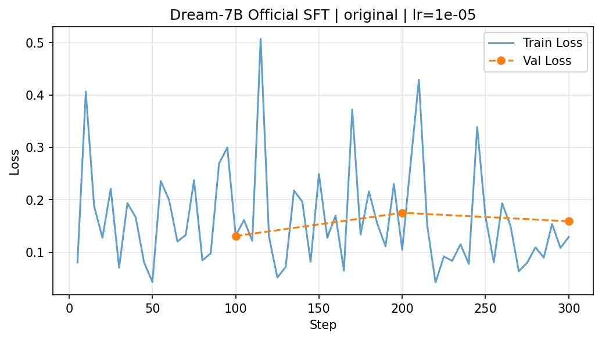

# Xenolinguistics: Dream-7B vs Qwen2.5-7B LoRA Fine-Tuning

> Diffusion LLM(Dream-7B)과 Autoregressive LLM(Qwen2.5-7B)의 LoRA SFT 가능성을 EN→FI 번역 태스크로 비교 검증한 실험 보고서.

---

## 1. 실험 목적

핀란드어(Finnish)는 교착어로 15개 격변화를 가지며, 인공어(퀘냐, 클링온 등) 실험의 파이프라인 검증에 적합하다. 본 실험은 다음을 검증한다:

1. **Diffusion LLM에 LoRA SFT가 가능한가?**
2. **AR LLM 대비 번역 품질은 어떠한가?**
3. **단일 Python 환경에서 두 모델을 동시에 운영할 수 있는가?**

## 2. 실험 환경

| 항목 | 값 |
|------|-----|
| GPU | NVIDIA RTX PRO 6000 Blackwell (98GB VRAM) |
| PyTorch | 2.10.0+cu128 |
| Transformers | 4.46.2 (Dream 호환 버전) |
| PEFT | 0.19.1 |
| TRL | 1.3.0 |
| 데이터셋 | Helsinki-NLP/opus-100 (en-fi) |

### 데이터셋 상세

| 분할 | 1k 셋 | 10k 셋 | 용도 |
|------|:------:|:------:|------|
| Train | 800문장 | 8,000문장 | 학습 |
| Validation | 100문장 | 1,000문장 | 학습 중 평가 |
| Test | 100문장 | 1,000문장 | 최종 chrF/BLEU 평가 |

- **출처**: [Helsinki-NLP/opus-100](https://huggingface.co/datasets/Helsinki-NLP/opus-100) (en-fi 서브셋)
- **내용**: 영화 자막 및 EU 공식 문서의 영어-핀란드어 병렬 코퍼스
- **형식**: JSONL — `{"instruction": "Translate to Finnish: ...", "output": "핀란드어 번역", "en": "...", "fi": "..."}`

## 3. 모델 구성

| 역할 | 모델 | 방식 | 파라미터 |
|------|------|------|---------|
| **Reference NMT** | Helsinki-NLP/opus-mt-tc-big-en-fi | 전용 NMT, 학습 없음 | 237.7M |
| **AR LLM** | Qwen/Qwen2.5-7B-Instruct | LoRA r=16, causal LM SFT | 7.6B (trainable: 10M, 0.13%) |
| **Diffusion LLM** | Dream-org/Dream-v0-Instruct-7B | LoRA r=16, 공식 SFT 포팅 | 7.6B (trainable: 10M, 0.13%) |

> **Dream-7B의 base LLM은 Qwen2.5-7B**이다. 동일한 base에서 출발하되 생성 방식(AR vs Diffusion)만 다른 비교가 가능하다.

## 4. 학습 설정

### 이전 실험 vs 공식 SFT 포팅 비교

Dream의 이전 실험(v1)은 학습 방식에 근본적 오류가 있었다. 공식 레포([DreamLM/Dream](https://github.com/DreamLM/Dream))의 SFT 코드를 분석하여 단일 GPU로 포팅(v2)한 후 재실험하였다.

| 항목 | Qwen2.5-7B (AR) | Dream-7B v1 (이전) | Dream-7B v2 (공식 포팅) |
|------|:---:|:---:|:---:|
| 데이터 | 1k (800/100/100) | 10k (8000/1000/1000) | **1k (800/100/100)** |
| Epochs | 3 | 3 | 3 |
| Effective batch | 8 | 16 | 8 |
| Learning rate | 2e-4 | 2e-4 | **1e-5** (공식 기본값) |
| Optimizer | AdamW | AdamW | AdamW (β=0.9,0.95, wd=0.01) |
| 학습 시간 | 0.8분 | 7.3분 | **2.9분** |
| Final train loss | 1.14 | 5.52 | **0.18** |
| Final val loss | 1.43 | 5.25 | **0.13** |

### Dream v1 → v2 핵심 수정사항

| 항목 | v1 (이전, 잘못됨) | v2 (공식 포팅, 수정됨) |
|------|-------------------|----------------------|
| **Logit shift** | 없음 (AR 방식 또는 model 내부 위임) | `cat([logits[:,0:1], logits[:,:-1]])` — 자기 위치 예측 |
| **마스킹 범위** | 전체 시퀀스(prompt 포함) 랜덤 | **response-only** (`loss_mask`로 prompt 제외) |
| **Attention mask** | 2D (causal 가능성) | **4D bidirectional** (`[B,1,L,L]`) |
| **Time reweighting** | 없음 | `1/t` (공식 `original` 모드) |
| **마스킹 함수** | 자체 구현 (단순 랜덤) | **`q_sample()` 공식 코드** (EOS 그룹 처리 포함) |
| **Loss 계산** | `model(labels=labels)` 위임 | CE → masked 위치만 → time weight → valid_token 평균 |
| **LR** | 2e-4 (AR용) | **1e-5** (공식 SFT 기본값) |

### 학습 곡선

| Qwen Loss Curve | Dream v2 Loss Curve |
|:---:|:---:|
|  |  |

## 5. 평가 결과

### 평가 지표 설명

| 지표 | 설명 | 범위 |
|------|------|------|
| **chrF** | Character F-score. 문자(character) n-gram 기반 유사도. 형태론이 복잡한 언어(핀란드어 등)에서 BLEU보다 신뢰도 높음. | 0~100 (높을수록 좋음) |
| **BLEU** | Bilingual Evaluation Understudy. 단어(word) n-gram 정밀도 기반. 기계번역의 전통적 표준 지표. 짧은 문장에서 변동 큼. | 0~100 (높을수록 좋음) |

### 정량 비교

| 모델 | 모드 | chrF | BLEU | 데이터 | 출력 품질 평가 |
|------|------|:----:|:----:|:------:|------|
| **opus-mt (Reference NMT)** | — | **56.91** | **37.45** | — | 자연스러운 핀란드어 문장 생성. 문법·어순 모두 정확. |
| **Qwen2.5-7B + LoRA** | AR 생성 | **33.61** | **16.27** | 1k | 문장 구조를 갖춘 핀란드어. 격변화 오류 있으나 의사소통 가능. |
| **Dream-7B + LoRA v2** | 공식 SFT | **19.51** | **9.79** | 1k | 문장 생성 성공. 의미 전달 가능하나 문법 오류 다수. |
| ~~Dream-7B + LoRA v1~~ | ~~이전 방식~~ | ~~7.03~~ | ~~0.83~~ | ~~10k~~ | ~~쓰레기 출력. 학습 방식 오류.~~ |

### v1 → v2 개선 폭

| 지표 | v1 (10k 데이터) | v2 (1k 데이터) | 개선 |
|------|:-:|:-:|------|
| chrF | 7.03 | **19.51** | **+12.48 (2.8배)** |
| BLEU | 0.83 | **9.79** | **+8.96 (11.8배)** |

> 데이터를 10배 줄이고도(10k→1k) 성능은 2.8배 향상. 학습 방식의 정확성이 데이터 양보다 중요함을 실증.

### 정성 비교 (동일 입력, 1k 데이터 기준)

| EN | 정답 (FI) | opus-mt | Qwen | Dream v2 | Dream v1 |
|----|-----------|---------|------|----------|----------|
| Yes! | Kyllä! | Jes! | Ja! | Joo! | -\n-\n-\n... |
| I don't make the rules. | En laadi sääntöjä. | Minä en laadi sääntöjä. | En tehdä sääntöjä. | Minä en tekeä sääntöjä. | En haluan. |
| How we doing? | Miten sujuu? | Miten menee? | Miten meidän on? | Miten toimim? | M? |
| Are you sure? - Yeah. | Oletko varma? | Oletko varma? | Oletko varma? | Olet varma? - Ja. | Oletko\n- O? |
| What are you going to do? | Eroatko sinä? | Mitä aiot tehdä? | Mitä teette? | Mitä tehdät? | Miksi? |
| So I see! | Siltä näyttää! | Vai niin! | Tässä on se. | Näin! | Nä!\n- N\n... |
| All right. | Okei. | Hyvä on. | Kaikki hyvin. | Oke. | Kaikki\n-\n-\n... |

### 해석

- **Dream v2**: 모든 문장에서 **완전한 핀란드어 문장을 생성**한다. v1의 반복 패턴(`-\n-\n`)과 garbage 토큰이 완전히 사라짐.
- **여전한 격차**: Qwen(chrF 33.6) 대비 Dream(chrF 19.5)은 약 14pt 뒤진다. 격변화 오류(`tekeä`→`tee`, `tehdät`→`teet`)가 Qwen보다 많다.
- **구조적 원인**: 번역은 순차적 대응이 핵심인 태스크로, AR 모델의 강점이 발휘되는 영역이다. Dream의 강점(병렬 생성, 임의 순서)은 planning 태스크(Sudoku, Countdown)에서 나타난다.

## 6. 기술적 발견사항

### Dream 공식 SFT 코드 분석 결과

Dream 공식 레포(`DreamLM/Dream`)의 `src/trainer/fsdp_sft_trainer.py` 분석을 통해 다음을 확인:

| 컴포넌트 | 공식 코드 위치 | 핵심 로직 |
|----------|---------------|----------|
| **마스킹** | `gen_utils.py:q_sample()` | response-only + EOS 그룹 처리 |
| **Loss** | `fsdp_sft_trainer.py:_compute_loss_and_backward()` | logit shift + CE + time/token reweight |
| **데이터** | `sft_dataset.py:SFTDataset` | chat_template + loss_mask (prompt=0, response=1) |
| **Attention** | 학습 시 4D bidirectional | `attention_mask.unsqueeze(1).unsqueeze(-2) & .unsqueeze(-1)` |

### Dream-7B 호환성 이슈 (해결됨)

| 이슈 | 원인 | 해결 |
|------|------|------|
| `ROPE_INIT_FUNCTIONS['default']` KeyError | transformers 5.0에서 `'default'` 키 제거됨 | 4.46.2로 다운그레이드 |
| `torchao` 버전 충돌 | peft 0.19.1이 torchao>=0.16.0 요구 | torchao 0.17.0 설치 |
| `diffusion_generate` 미사용 | 공식 API 대신 자체 denoising 구현 | 공식 `diffusion_generate()` + `DreamGenerationConfig` 사용 |
| 학습-추론 format 불일치 | 학습: plain text, 추론: chat_template | 학습도 `apply_chat_template` 사용 |
| 전체 토큰 masking | prompt도 mask → capacity 낭비 | **Response-only masking** (`q_sample` + `loss_mask`) |
| logit shift 누락 | AR 방식으로 next-token 예측 | **자기 위치 예측**: `cat([logits[:,0:1], logits[:,:-1]])` |
| time reweighting 누락 | 모든 마스크 비율에 동일 가중치 | `1/t` reweighting으로 저마스크 비율 강조 |
| PeftModel GenerationConfig 충돌 | PeftModel이 standard GenerationConfig 사용 | `DreamGenerationConfig`를 명시적 전달 |

### `diffusion_generate` 핵심 파라미터

```python
model.diffusion_generate(
    input_ids,
    attention_mask=attention_mask,
    max_new_tokens=64,
    steps=128,           # diffusion timesteps
    temperature=0.2,     # sampling temperature
    top_p=0.95,          # nucleus sampling
    alg="entropy",       # remasking: entropy > maskgit_plus > origin
    alg_temp=0.,         # confidence randomness
)
```

## 7. 결론

### LoRA Fine-Tuning 가능성

| 모델 | LoRA 적용 | SFT 수렴 | 번역 품질 |
|------|:---------:|:--------:|:---------:|
| Qwen2.5-7B | ✅ | ✅ | ✅ 실용 수준 (chrF 33.6) |
| Dream-7B (공식 SFT) | ✅ | ✅ | ⚠️ 문장 수준 (chrF 19.5) |

### 핵심 결론

1. **공식 SFT 방식으로 Dream의 번역 품질이 대폭 개선되었다.** chrF 7.0→19.5 (+178%), BLEU 0.8→9.8 (+1079%). 데이터는 오히려 1/10로 줄었음.
2. **학습 방식의 정확성이 데이터 양보다 중요하다.** v1은 10k 데이터로 chrF 7.0, v2는 1k로 chrF 19.5. logit shift, response-only masking, time reweighting, 4D bidirectional attention이 핵심.
3. **그러나 AR LLM과의 격차는 여전하다.** Qwen chrF 33.6 vs Dream chrF 19.5 (동일 1k 데이터). 번역은 순차적 생성이 유리한 태스크로 구조적 한계.
4. **Dream의 진정한 강점은 planning이다.** 논문 벤치마크: Countdown 16.0 vs Qwen 6.2, Sudoku 81.0 vs 21.0. 번역이 아닌 탐색/계획 태스크에서 평가해야 함.
5. **단일 환경 운영**: `transformers==4.46.2` + `torch==2.10.0`에서 두 모델 모두 정상 동작 확인.

### 인공어 실험 확장성

핀란드어 파이프라인 검증 완료. 클링온/퀘냐/칼라니어 실험은 데이터 파일만 교체하면 동일 파이프라인 재사용 가능. Dream은 **공식 SFT 방식 적용 시 실질적 학습이 가능**하나, 번역 태스크에서는 Qwen이 더 효율적.

---

## 8. 파일 구조

```
Xenolinguistics/
├── README.md                          # 이 보고서
├── CLAUDE.md                          # 실험 지시서
├── train_dream_official.py            # Dream 공식 SFT 단일GPU 포팅
├── eval_dream_official.py             # Dream 공식 SFT 평가
├── data/                              # 데이터셋 (gitignored)
│   ├── train_1k.jsonl / val / test
│   └── train_10k.jsonl / val / test
├── outputs/
│   ├── reference/eval_results.json    # opus-mt 평가 결과
│   ├── qwen/
│   │   ├── adapter/                   # LoRA weights (gitignored)
│   │   ├── training_meta.json
│   │   ├── eval_results.json
│   │   └── loss_curve_1k.png
│   ├── dream/                         # v1 (이전 방식, 참고용)
│   │   ├── adapter/
│   │   ├── training_meta.json
│   │   ├── eval_results.json
│   │   └── loss_curve_1k.png
│   └── dream_official/                # v2 (공식 SFT 포팅)
│       ├── adapter_best/              # Best val loss checkpoint
│       ├── adapter_final/             # Final checkpoint
│       ├── training_meta.json
│       ├── eval_results.json
│       └── loss_curve.png
└── logs/
    ├── smoke_test_result.txt
    ├── env_info.txt
    ├── model_check.json
    ├── phase0_done.txt
    └── phase1_done.txt
```

---

## 9. 참조 링크

| 리소스 | URL |
|--------|-----|
| **데이터셋** | [Helsinki-NLP/opus-100](https://huggingface.co/datasets/Helsinki-NLP/opus-100) |
| **Dream-7B (Diffusion LLM)** | [Dream-org/Dream-v0-Instruct-7B](https://huggingface.co/Dream-org/Dream-v0-Instruct-7B) |
| **Dream 공식 레포** | [DreamLM/Dream](https://github.com/DreamLM/Dream) |
| **Dream 논문** | [arXiv:2508.15487](https://arxiv.org/abs/2508.15487) |
| **Qwen2.5-7B (AR LLM)** | [Qwen/Qwen2.5-7B-Instruct](https://huggingface.co/Qwen/Qwen2.5-7B-Instruct) |
| **Reference NMT** | [Helsinki-NLP/opus-mt-tc-big-en-fi](https://huggingface.co/Helsinki-NLP/opus-mt-tc-big-en-fi) |
| **PEFT (LoRA)** | [huggingface/peft](https://github.com/huggingface/peft) |

---

*2026-05-09 | 공식 SFT 포팅 후 재실험 반영*
