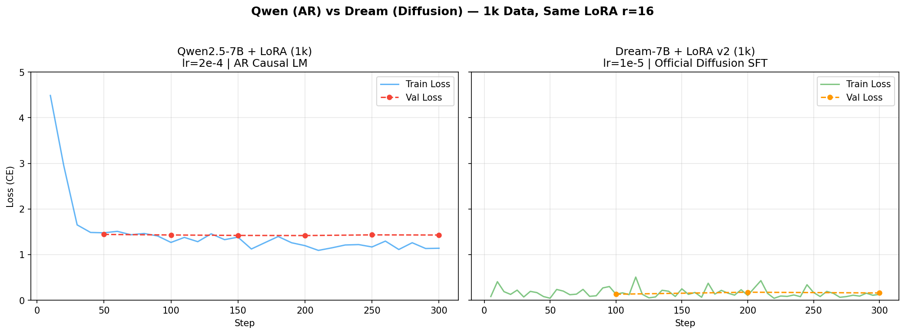

# Qwen vs Dream 번역 능력 비교 (핀란드어)

> 2026-05-09

## 요약

- Dream-7B의 공식 Post Training 방식을 단일 GPU로 포팅하여 학습 정상화 (chrF 7→19.5)
- 1k 학습: Qwen chrF 33.6, Dream chrF 19.5
- 10k 학습: Qwen chrF 41.7 (+24%), Dream chrF 18.6 (변화 미미)

---

## 1. Dream 공식 SFT 반영

[DreamLM/Dream](https://github.com/DreamLM/Dream)의 Post Training 코드를 단일 GPU용으로 포팅하였다. 공식 SFT는 response-only 마스킹, 자기 위치 예측(logit shift), 4D bidirectional attention, `1/t` time reweighting을 사용한다. 이를 반영한 v2는 1k 데이터만으로 v1(10k)보다 chrF 2.8배 향상되었다.

---

## 2. 실험 설계

### 데이터셋

| 셋 | Train | Val | Test | 인덱스 범위 |
|----|------:|----:|-----:|------------|
| 1k | 800 | 100 | 100 | opus-100[0:1000] |
| 10k | 8,000 | 1,000 | 1,000 | opus-100[0:10000] |
| 100k | 80,000 | 10,000 | 10,000 | *TBD* |

- 출처: Helsinki-NLP/opus-100 (en-fi), 영화 자막 + EU 문서
- 형식: JSONL `{"instruction": "Translate to Finnish: ...", "output": "...", "en": "...", "fi": "..."}`
- 스케일 간 비교 시 동일 test_1k(100문장) 사용

### 학습 설정

| 항목 | Qwen (AR) | Dream v2 (Diffusion) |
|------|:---:|:---:|
| Base model | Qwen2.5-7B-Instruct | Dream-v0-Instruct-7B |
| LoRA r / alpha | 16 / 32 | 16 / 32 |
| Trainable params | 10M (0.13%) | 10M (0.13%) |
| Learning rate | 2e-4 | 1e-5 |
| Epochs | 3 | 3 |
| Effective batch | 8 | 8 |
| Loss | CE (next-token) | CE(masked) / t |
| Attention | Causal | Bidirectional (4D) |
| 학습 시간 (10k) | 13.3분 | 29.2분 |

LR 차이: Dream은 time reweighting으로 gradient 스케일이 다르므로 공식 기본값(1e-5)을 사용한다.

---

## 3. 결과

### Loss 커브 (1k, Y축 0-5 동일 스케일)



- 좌: Qwen — loss 4.5→1.1, 전형적 AR 수렴
- 우: Dream — 0.04~0.5 변동, 평균 0.15. 이는 `1/t` reweighting과 timestep 샘플링에 의한 정상 패턴

> 두 loss는 스케일이 다르므로 직접 비교 불가. 각각의 수렴 추이로 판단한다.

### 번역 성능 (test_1k, 100문장)

| 모델 | 1k chrF | 1k BLEU | 10k chrF | 10k BLEU | 100k chrF | 100k BLEU |
|------|:-------:|:-------:|:--------:|:--------:|:---------:|:---------:|
| opus-mt (Reference) | 56.91 | 37.45 | — | — | — | — |
| Qwen + LoRA | 33.61 | 16.27 | **41.72** | **22.89** | *TBD* | *TBD* |
| Dream v2 + LoRA | 19.51 | 9.79 | **18.56** | **9.58** | *TBD* | *TBD* |

- Qwen 1k→10k: chrF **+8.1** (+24%), BLEU **+6.6** (+41%)
- Dream 1k→10k: chrF **-0.9** (-5%), BLEU **-0.2** (-2%) — 데이터 증가 효과 없음

### 정성 비교 (1k 학습)

| EN | 정답 (FI) | opus-mt | Qwen | Dream v2 |
|----|-----------|---------|------|----------|
| Yes! | Kyllä! | Jes! | Ja! | Joo! |
| I don't make the rules. | En laadi sääntöjä. | Minä en laadi sääntöjä. | En tehdä sääntöjä. | Minä en tekeä sääntöjä. |
| How we doing? | Miten sujuu? | Miten menee? | Miten meidän on? | Miten toimim? |
| What are you going to do? | Eroatko sinä? | Mitä aiot tehdä? | Mitä teette? | Mitä tehdät? |

---

## 4. 분석

### LoRA r=16 적정성

- 7B 모델 대비 0.13% trainable — 번역 SFT에 적절
- r=8: 복잡 문법 학습 제한. r=32+: 과적합 위험
- **결론**: r=16 유지. 50k+ 데이터 시 r=32 검토

### 데이터 스케일링 권장

| 요인 | 현재 | 권장 | 근거 |
|------|------|------|------|
| 데이터 | 10k | 20k~50k | 1k→10k에서 chrF +24%. 50k 이상은 수확 체감 예상 |
| Epochs | 3 | 3~5 | 과적합 시 early stop |
| 학습 시간 (Qwen 50k) | — | ~70분 | 선형 증가 |
| 학습 시간 (Dream 50k) | — | ~150분 | Custom loop 오버헤드 |

---

## 5. 다른 언어 SFT 데이터셋 가이드

### 형식

```json
{"instruction": "Translate to [TARGET]: [SOURCE]", "output": "[TARGET_TEXT]", "en": "[SOURCE]", "[code]": "[TARGET_TEXT]"}
```

### 실제 샘플 (본 실험 en→fi)

```json
{"instruction": "Translate to Finnish: He's your brother.", "output": "Sinun veljesi.", "en": "He's your brother.", "fi": "Sinun veljesi."}
{"instruction": "Translate to Finnish: Jacob...", "output": "Jacob.", "en": "Jacob...", "fi": "Jacob."}
```

### 요구사항

| 항목 | 권장 |
|------|------|
| 분량 | 10k~50k (검증용 1k, 고품질 50k+) |
| 분할 | Train 80% / Val 10% / Test 10% |
| 문장 길이 | 평균 10~30 tokens, max 256 이하, 분포 다양 |
| 품질 | 1:1 대응, 중복 제거, 도메인 다양 |
| 인공어 | 문법 일관성 > 양 |

---

## 6. 결론

1. **Dream 학습 정상화**: 공식 Post Training 코드 반영으로 chrF 7→19.5
2. **Qwen 스케일링 효과**: 1k→10k에서 chrF +24%. 추가 스케일링 여지 있음
3. **Dream 스케일링 정체**: 1k→10k에서 chrF 변화 없음 (19.5→18.6). 데이터 양만으로는 개선 한계. LR, epoch, LoRA rank 등 하이퍼파라미터 튜닝 또는 학습 전략 재검토 필요

---

*2026-05-09*
