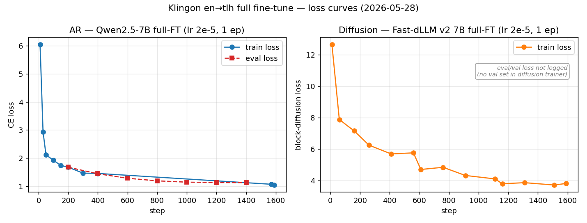

# 2026-05-28 — Klingon(인공어) AR vs Diffusion, full fine-tune

| 항목 | 값 |
|---|---|
| 작성 | dargma |
| 날짜 | 2026-05-28 |
| 런 디렉터리 | `outputs/klingon_qwen_fullft/`, `outputs/klingon_fastdllm_fullft/` |
| Git commit | `0709965` (기반) |
| AR 체크포인트 (HF) | https://huggingface.co/sungkwang2/klingon-en2tlh-qwen2.5-7b-fullft |
| Diffusion 체크포인트 (HF) | https://huggingface.co/sungkwang2/klingon-en2tlh-fastdllm-v2-7b-fullft |

## 가설 (H1)

인공어는 어휘뿐 아니라 **어순**도 영어와 다르고 LLM 사전학습에 (대체로) 포함되지 않는다.
양방향 denoising으로 디코딩하는 **Diffusion LLM**이 좌→우 단방향 **AR LLM**보다 인공어를 —
특히 어순을 — 더 잘 학습할 것이다. 본 보고서는 **Klingon**(OVS 어순, 실제 문장 코퍼스) 축을 다룬다.

## 데이터

- 출처: OPUS **Tatoeba en-tlh** v2023-04-12 (CC-BY). 중복 제거 후 **13,717쌍**.
- 분할(`data/klingon/`): train 12,717 / val 500 / test 500. 생성: `prepare_klingon.py`.
- 방향: **en→klingon** (생성 시 어순이 드러남).

## 학습 설정

| | AR | Diffusion |
|---|---|---|
| 모델 | `Qwen/Qwen2.5-7B-Instruct` | `Efficient-Large-Model/Fast_dLLM_v2_7B` |
| 방식 | **full fine-tune** | **full fine-tune** |
| LR | 2e-5 | 2e-5 |
| Epochs | 1 | 1 |
| Eff. batch | 8 | 8 |

LR·epoch·effective batch를 **동일**하게 맞춰 아키텍처만 변수로 분리. LoRA는 배제 —
선행 en→fi 실험에서 Fast-dLLM은 LoRA로는 (rank를 키워도) 거의 학습되지 않아, LoRA 비교는
Diffusion에 불리한 핸디캡이 되기 때문. full-FT가 유일한 공정 공통 기반.

## Loss 곡선



- **AR(Qwen)**: train 6.05 → 1.04, **eval_loss 1.677 → 1.129** (7개 지점 단조 하강) → 과적합 없이 일반화.
- **Diffusion(Fast-dLLM)**: train(블록 디퓨전 손실, 스케일 다름) 12.67 → 3.81 단조 하강. (디퓨전 트레이너엔 val 셋 없음.)
- 곡선 포인트는 학습 로그에서 캡처(체크포인트 trainer_state는 디스크 정리로 pruned). 생성기: `reports/figures/2026-05-28-klingon-loss.py`.

## 평가 방법

스크립트 `eval_ft.py`, **0-shot**(instruction만), **양쪽 free-length 대칭**(gt_length 오라클 제거 →
어느 쪽도 정답 길이를 받지 않음), `n_eval=300`, `data/klingon/test.jsonl`. AR = greedy(`do_sample=False`);
Diffusion = `mdm_sample`(block_size 32, threshold 0.9, free). 메트릭: `sacrebleu` chrF/BLEU + exact-match
+ **어순 τ**(정답에 포함된 단어들의 순서에 대한 Kendall τ — 어휘와 분리된 어순 신호).

```bash
HF_HOME=/content/local_fast/hf_cache python3 eval_ft.py --model_type ar \
  --model_path outputs/klingon_qwen_fullft/final --n_eval 300 --out outputs/klingon_ft_eval_ar.json
HF_HOME=/content/local_fast/hf_cache python3 eval_ft.py --model_type diffusion \
  --model_path outputs/klingon_fastdllm_fullft/final --n_eval 300 --out outputs/klingon_ft_eval_diffusion.json
```

## 결과

숫자는 `outputs/klingon_ft_eval_ar.json` / `outputs/klingon_ft_eval_diffusion.json` (n=300).

| 메트릭 | AR (Qwen) | Diffusion (Fast-dLLM) | 우세 |
|---|:---:|:---:|:---:|
| chrF | **38.43** | 35.67 | AR (근소) |
| BLEU | **10.40** | 2.55 | AR (큰 차) |
| Exact match | 8.33 | **8.67** | 무승부 |
| **어순 τ** | 0.909 (n=77) | **0.936** (n=68) | **Diffusion** |

참고: 무학습 few-shot ICL에선 양쪽 chrF ~10–11 → **full-FT로 ~4배 상승**(AR 10.6→38.4), 인공어가
12.7k쌍으로 학습됨을 확인.

## 실제 예제 (test 셋, 후처리 후)

`outputs/klingon_ft_eval_*.json`의 `examples`에서 그대로 인용.

| English | Reference (tlh) | AR | Diffusion |
|---|---|---|---|
| I hate lawyers. | `chut qeSwI'pu' vImuS.` | `chut qeSwI'pu' vImuS.` ✅정확 | `chut qeSwI' vImuS.` |
| Are you coming to the store with me? | `ngevwI'Daq vIghoStaHvIS chotlhej'a'?` | `jIghoStaH'a' chaHvaD beylIjDaq?` | `ngevwIj vIjaHmeH chutlhe'taH'a'?` |
| What do we draw? | `nuq wIDIj?` | `nuq wIHIv?` | `nuq wIlo' 'e' wIvang?` |
| She is dark-skinned. | `Hurgh DIrDaj.` | `Doch 'IH ghaH.` | `DochwIj pIghqu' ghaH.` |
| My mouth forms a lot of saliva. | `tlhepQe' law' lIng nujwIj.` | `tlhoS jIbIjqu' 'oH jatlhlu'wIj'e'.` | `, we have 1, 2, 3, 4, 5, …` ⚠️degenerate |
| I like to look at old pictures. | `ngo'bogh mIlloghmey beQ vItIv.` | `mIllogh qonwI'pu' vIlegh vIneH.` | `, we have 1, 2, 3, 4, 5, …` ⚠️degenerate |

- AR은 "I hate lawyers"에서 **정답 완전 일치**, 대체로 Klingon 형태론(접사 `-pu'`, `vI-`, `-'a'`)을 살린 문장 생성.
- Diffusion은 일부 정상(`ngevwIj vIjaHmeH chutlhe'taH'a'?`)이나 **일부 입력에서 `, we have 1,2,3,…` 반복 붕괴** → BLEU를 크게 깎음.

## 추론 스크립트

### AR (Qwen2.5-7B) — 표준 generate
```python
import torch
from transformers import AutoModelForCausalLM, AutoTokenizer

mid = "sungkwang2/klingon-en2tlh-qwen2.5-7b-fullft"
tok = AutoTokenizer.from_pretrained(mid)
model = AutoModelForCausalLM.from_pretrained(mid, torch_dtype=torch.bfloat16, device_map="auto").eval()

def translate(en):
    msgs = [{"role": "user", "content": f"Translate to Klingon: {en}"}]
    p = tok.apply_chat_template(msgs, add_generation_prompt=True, tokenize=False)
    ids = tok(p, return_tensors="pt").to(model.device)
    out = model.generate(**ids, max_new_tokens=64, do_sample=False, pad_token_id=tok.eos_token_id)
    return tok.decode(out[0][ids.input_ids.shape[1]:], skip_special_tokens=True).strip()

print(translate("I hate lawyers."))   # -> chut qeSwI'pu' vImuS.
```

### Diffusion (Fast-dLLM v2 7B) — 블록 디퓨전 샘플링
`fastdllm_generation.py`(이 repo)와 **transformers 4.x**(5.x는 생성이 깨짐)가 필요.
가장 간단한 재현은 repo의 `eval_ft.py`:
```bash
python3 eval_ft.py --model_type diffusion \
  --model_path sungkwang2/klingon-en2tlh-fastdllm-v2-7b-fullft \
  --test_file data/klingon/test.jsonl --n_eval 10
```
핵심 호출(요약):
```python
import types, torch
from transformers import AutoModelForCausalLM, AutoTokenizer
import fastdllm_generation as gf  # repo 파일 (rope/DynamicCache 호환 패치 포함)

mid = "sungkwang2/klingon-en2tlh-fastdllm-v2-7b-fullft"
tok = AutoTokenizer.from_pretrained(mid, trust_remote_code=True)
model = AutoModelForCausalLM.from_pretrained(mid, torch_dtype=torch.bfloat16,
            device_map="cuda", trust_remote_code=True).eval()
model.mdm_sample = types.MethodType(gf.Fast_dLLM_QwenForCausalLM.batch_sample, model)
mask_id = tok.encode("|<MASK>|", add_special_tokens=False)[0]

msgs = [{"role": "user", "content": "Translate to Klingon: I hate lawyers."}]
p = tok.apply_chat_template(msgs, add_generation_prompt=True, tokenize=False)
ids = tok(p, return_tensors="pt").input_ids.to(model.device)
out = model.mdm_sample(ids, tokenizer=tok, block_size=32, small_block_size=32,
        max_new_tokens=64, mask_id=mask_id, min_len=ids.shape[1],
        seq_len=torch.tensor([ids.shape[1]], device=model.device),
        use_block_cache=True, threshold=0.9)
print(tok.decode(out[0][ids.shape[1]:], skip_special_tokens=True).strip())
```

## 해석

혼합·메트릭 의존적. **H1 약한 지지**: H1의 핵심 지표인 어순 τ에서 **Diffusion(0.936) > AR(0.909)** —
맞은 단어를 정답 순서대로 배치하는 능력은 Diffusion이 미세 우위(양방향 디코딩이 어순에 유리하다는
가설과 일치). 반면 전체 유창성/정밀도(chrF, BLEU)는 AR 우세이며, 이는 Diffusion의 degenerate 반복
모드가 일부 입력에서 n-gram 정밀도를 무너뜨리기 때문. **깨끗한 승부는 아님.**

## 주의 (caveat)

1. Klingon은 온라인 자료가 많아 **Qwen 사전학습에 포함됐을 가능성** → 부분적으로 *회상*이지 순수 *학습*이 아님(H1의 "미지 언어" 전제 오염). 더 깨끗한 미지 축은 Khalani(단, 55쌍이라 FT엔 부적합).
2. single seed, Diffusion은 샘플링 비결정적 → 작은 τ 격차 신뢰엔 ≥3 seed 필요.
3. 1 epoch, Diffusion 디코딩 하이퍼파라미터(block_size/threshold) 미튜닝.
4. 어순 τ는 ≥2개 단어가 일치한 test 쌍(68–77개)에서만 계산 → 검정력 보통.

## 재현

환경: `transformers` 4.x, `trl 0.19.1`, `torchao 0.17.0`, `peft 0.19.1`.
```bash
python3 prepare_klingon.py
# AR
python3 train_qwen_v4.py --train_file data/klingon/train.jsonl --val_file data/klingon/val.jsonl \
  --lora_rank 0 --lr 2e-5 --epochs 1 --batch_size 8 --grad_accum 1 --output_dir outputs/klingon_qwen_fullft
# Diffusion
python3 train_fastdllm.py --train_file data/klingon/train.jsonl --output_dir outputs/klingon_fastdllm_fullft \
  --lora_rank 0 --lr 2e-5 --epochs 1 --batch_size 4 --grad_accum 2
```
