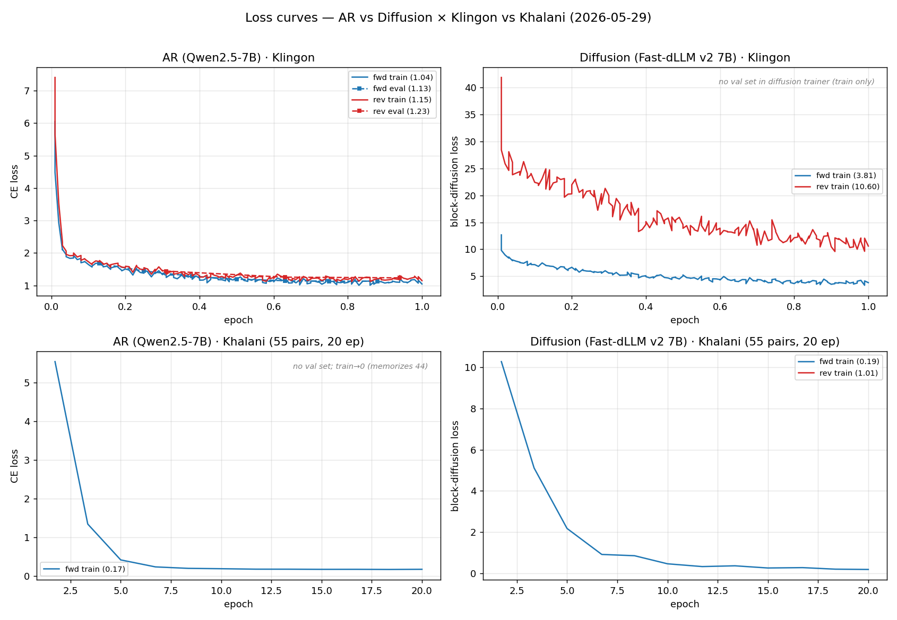

# 2026-05-29 — 인공어 AR vs Diffusion: 2 데이터셋 × 2 방향 종합

## 0. 목차

1. **요약** — 핵심 발견(방향에 따라 우열이 갈림)
2. **방법** — 2.1 데이터 · 2.2 학습(+Loss 곡선) · 2.3 평가(생성·길이·메트릭)
3. **결과** — 3.1 정량 · 3.2 정성
4. **논의** — 해석 · 주의(caveat)
5. **재현성** — 실행 스크립트
6. **링크** — HF 모델 · 데이터셋

---

## 1. 요약

같은 7B 백본의 **AR LLM**(Qwen2.5-7B-Instruct)과 **Diffusion LLM**(Fast-dLLM v2 7B)이 인공어를
얼마나 잘 배우는지를, **두 인공어**(Klingon 12.7k · Khalani 55쌍) × **두 방향** × **두 아키텍처**에서
**완전히 동일한 full-FT 설정**으로 비교했다 (**순방향** = en→인공어, **역방향** = 인공어→en).

**핵심 발견 — 어느 쪽이 우세한지는 방향에 따라 달라진다.**
- **순방향**: **AR 우세** — chrF 38.4 vs 35.7, BLEU 10.4 vs 2.6.
- **역방향**: **Diffusion이 chrF를 역전**(41.4 vs 37.2). 출력이 모델이 이미 아는 영어라 양방향 모델이
  유리한 것으로 보임 (상세 해석은 §4).
- **Khalani(55쌍)**: 데이터가 너무 적어 양쪽 다 외우기만 함(test EM 0) → 결론 불가.
- **종합**: "한 아키텍처가 인공어에 일관 우월"하다는 증거 없음. **우위는 방향·지표에 의존.**

---

## 2. 방법

### 2.1 데이터

| 언어 | 설명 | 데이터셋 | 어순 |
|---|---|---|---|
| **Klingon** (tlh) | 〈스타트랙〉 외계 종족 '클링온'의 언어. Marc Okrand가 문법까지 설계한 실제 작동 인공어. | train 12,717 / val 500 / test 500 | **OVS** (목적어–동사–주어; 영어 SVO와 정반대) |
| **Khalani** (kha) | 게임 〈스타크래프트〉 외계 종족 '프로토스'의 언어. 단편적 대사·구호 위주. | train 44 / test 11 (총 55, val 없음) | (소량, 분석 불가) |

각 데이터는 (영어 문장 ↔ 인공어 문장) 한 쌍이다. 순방향은 이 쌍을 'en→인공어'로, 역방향은 같은 쌍을
뒤집어 '인공어→en'으로 쓴다 — **두 방향이 똑같은 문장쌍**이라 데이터 차이 없이 방향만 공정하게 비교된다.
(역방향 파일은 `*_tlh2en.jsonl`. 데이터 생성: `prepare_klingon.py` · `prepare_khalani.py`.)

### 2.2 학습

학습 설정은 8개 런에서 모두 똑같이 맞추고, **AR이냐 Diffusion이냐**만 바꿔가며 비교했다. LoRA는 쓰지 않았다 —
선행 en→fi 실험에서 Fast-dLLM은 LoRA로는 거의 학습되지 않아, LoRA로 비교하면 Diffusion이 불리해지기 때문이다(full-FT가 유일한 공정한 공통 기반).

| 방식 | LR | Epochs | Eff. batch | max_len |
|---|---|---|---|---|
| full fine-tune (`lora_rank=0`) | 2e-5 | 1 (Khalani만 20) | 8 (AR bs8×acc1 / Diff bs1×acc8) | 512 |

**Loss 곡선** (4-패널 = 아키텍처 × 언어; Klingon은 순·역 겹쳐 그림, AR은 eval loss 점선도 포함.
Diffusion 트레이너엔 val 셋이 없어 train만). 생성기 `reports/figures/2026-05-29-loss.py`.



| 런 | train loss (시작→끝) | eval loss |
|---|---|---|
| Klingon en→tlh AR | 6.05 → **1.04** | 1.68→**1.13** (단조↓, 과적합 없음) |
| Klingon en→tlh Diff | 12.67 → **3.81** | (val 없음) |
| Klingon tlh→en AR | → **1.15** | 1.44→**1.23** |
| Klingon tlh→en Diff | 28 → **~10.6** (평균 16.4) | (val 없음) |
| Khalani 양방향 AR | → **~0.18** (44개 암기) | (val 없음) |
| Khalani 양방향 Diff | → 0.19 (순) / 6.8 (역, 평균) | (val 없음) |

순방향 Diffusion은 3.81까지 내려가나 역방향은 ~10.6에서 정체(이 괴리의 해석은 §4).
Khalani는 양쪽 다 0 근처로 추락 = 44개 암기.

### 2.3 평가 방법

`eval_ft.py`로 **0-shot 번역**(예시 없이 instruction만 주고 생성). 각 방향의 instruction 원문(데이터의
`instruction` 필드, 모델의 chat template에 user 메시지로 투입):

| 언어 · 방향 | instruction |
|---|---|
| Klingon en→tlh | `Translate to Klingon: <영어 문장>` |
| Klingon tlh→en | `Translate to English: <클링온 문장>` |
| Khalani en→kha | `Translate to Khalani: <영어 문장>` |
| Khalani kha→en | `Translate to English: <칼라니 문장>` |

AR과 Diffusion은 문장을 생성하는 방식이 근본적으로 달라 공정한 비교가 까다롭다. 이를 위해 두 가지를 통제했다.

첫째, **두 모델에 동일한 생성 예산**을 부여했다. Diffusion은 채울 빈칸의 길이를 미리 지정해야 하는데,
이 길이를 정답에서 가져오면 부당한 이점이 된다. 따라서 두 모델 모두 최대 64토큰까지만 생성하도록 동일하게
제한하고(`max_new_tokens=64`, 선행 en→fi 실험과 같은 원칙), 실제 출력 길이는 모델이 스스로 결정하게 했다.
64토큰은 충분한 여유로, test 정답이 최대 42토큰·학습 입력이 최대 224토큰(<512)이어서 학습·평가 모두에서
잘림이 발생하지 않았다(절단 0%).

둘째, **출력 길이는 두 모델이 각자 결정**한다. 64는 상한일 뿐이며, 생성을 어디서 멈출지는 모델마다 다르다:

| | **AR (Qwen)** | **Diffusion (Fast-dLLM v2)** |
|---|---|---|
| 생성 방식 | 토큰을 왼쪽에서 오른쪽으로 1개씩 (greedy) | 64토큰 빈칸을 32토큰 블록 단위로 채움 (`mdm_sample`, threshold 0.9) |
| 멈추는 법 | EOS 토큰이 나오면 정지 | EOS(id 151645)가 확정되면 그 뒤는 버리고(pad) 남은 블록도 건너뜀 |
| 후처리 | 결과의 첫 번째 줄만 사용 | 동일 |

**평가 모드 두 가지** (같은 64 예산으로 생성한 뒤 채점 방식만 다름, `--mode`):
- **`free`** (기본): 모델이 끝낸 자연스러운 길이 그대로 채점. 어느 쪽도 정답 길이를 모름 → 가장 공정.
- **`gt_length`**: 생성 결과를 정답 토큰 수만큼 잘라서 채점(`gen_ids[:gt_tok]`, en→fi와 동일 로직).
  예산(64)이 정답(≤42)보다 길므로, 길이를 줄이는 건 예산 한도가 아니라 이 컷이다.

**Diffusion은 몇 번 계산하나.** AR은 토큰 1개당 forward 1회로 고정이지만, Diffusion은 블록마다
"확신도>0.9인 토큰을 한꺼번에 확정"하는 식이라 횟수가 문장마다 다르다. **실측(문장 20개)**: 순방향
평균 **30.1회**(23–41), 역방향 **27.0회**(18–38) — threshold 0.9에선 대략 토큰 1개당 1회 수준.

**채점 지표:**
- **chrF** — 문자 n-gram F-score. 교착어 형태(접사)에 강건. **대표 지표.**
- **BLEU** — 단어 n-gram precision. 반복·degenerate 출력에 가혹.
- **EM** — 정답과 완전히 같은 비율(%).

---

## 3. 결과

### 3.1 정량 평가

**Klingon** (n=300, `outputs/klingon[_tlh2en]_ft_eval_*.json`). 셀 = **AR / Diffusion**, 굵게 = 우세.

| 방향 | 모드 | chrF | BLEU | EM |
|---|---|:---:|:---:|:---:|
| en→tlh | free | **38.43**/35.67 | **10.40**/2.55 | 8.33/**8.67** |
| | gt_length | **36.96**/33.95 | **10.15**/5.06 | **8.67**/8.33 |
| tlh→en | free | 37.19/**41.40** | **20.40**/17.91 | 7.33/**9.00** |
| | gt_length | 36.34/**39.13** | 19.51/**20.26** | 7.33/**9.00** |

- 순방향: chrF·BLEU 모두 AR (양 모드 일관).
- 역방향: chrF는 Diffusion 역전. BLEU는 free에선 AR, gt_length에선 Diffusion(20.26)이 따라붙음.

**Khalani** (학습 44 / 평가 11, epochs 20). `outputs/khalani[_kha2en]_ft_eval_*.json`.

| 방향 | 모드 | chrF | BLEU | EM |
|---|---|:---:|:---:|:---:|
| en→kha | free | 13.20/**14.94** | **7.68**/0.00 | 0/0 |
| kha→en | free | **11.82**/11.08 | 2.41/**2.71** | 0/0 |

**암기 판정 근거** — 같은 모델을 *학습에 쓴 44개*에 다시 돌리면 AR이 chrF·EM **100**
(`khalani_ft_eval_ar_train.json`)으로 본 문장을 그대로 재현하지만, 위 *안 본 11개*에선 chrF ~13·EM 0으로
붕괴한다. 언어를 배웠다면 test도 높아야 하므로, **train 100 ↔ test 0 격차** = 교과서적 과적합(학습이
아니라 암기). 방향·아키텍처 차이는 **n=11이라 노이즈** — 55쌍은 결론 불가.

### 3.2 정성 평가

**Klingon en→tlh**:

| English (src) | Klingon (ref) | AR | Diffusion |
|---|---|---|---|
| I hate lawyers. | `chut qeSwI'pu' vImuS.` | `chut qeSwI'pu' vImuS.` ✅ | `chut qeSwI' vImuS.` |
| What do we draw? | `nuq wIDIj?` | `nuq wIHIv?` | `nuq wIlo' 'e' wIvang?` |
| My mouth forms a lot of saliva. | `tlhepQe' law' lIng nujwIj.` | `tlhoS jIbIjqu'...` | `, we have 1, 2, 3, …` ⚠️degenerate |

AR은 형태론(접사 `-pu'`,`vI-`,`-'a'`)을 살림. Diffusion은 일부 입력에서 `, we have 1,2,3,…` 반복
붕괴 → 순방향 BLEU 2.55의 주원인.

**Klingon tlh→en**:

| Klingon (src) | English (ref) | AR | Diffusion |
|---|---|---|---|
| `ngevwI'Daq vIghoStaHvIS chotlhej'a'?` | Are you coming to the store with me? | May I go with you to the museum? | Would you come with me to the back of the store? |
| `mIlloghvam 'ey law' Hoch latlh mIlloghmey...` | This is the finest picture I have ever seen. | This picture is the most beautiful one I have ever seen | This picture is the best of all the pictures I've seen |

양쪽 다 **문법적으로 자연스러운 영어**를 만들지만 의미는 자주 빗나감. Diffusion이 핵심어(store, come
with me)를 더 자주 보존 → 역방향 chrF 우세와 일치.

**Khalani en→kha**:

| English (src) | Khalani (ref) | AR | Diffusion |
|---|---|---|---|
| Prismatic core online | `Peradak kural` | `Peradak aghanizha` (첫 단어만) | `Peradak kry` (첫 단어만) |
| Oblivion awaits | `Zerashk Gulida` | `Oblivionak tara` (영어 잔재) | `Oblivion n'` (붕괴) |

**Khalani kha→en**:

| Khalani (src) | English (ref) | AR | Diffusion |
|---|---|---|---|
| `Peradak kural` | Prismatic core online | Prismatic beams aligning | `Prismaticismatic beams` ⚠️반복 붕괴 |
| `Zerashk Gulida` | Oblivion awaits | Duty is my shield | `Zero Pointk Unle` (붕괴) |
| `Ik ku dar anai` | It shall be done | I feel your presence | Our minds are as one |

Khalani는 양방향 모두 정답 어휘를 거의 못 맞히고(EM 0), 학습셋에서 본 다른 Protoss 대사를 끌어다 쓰거나
(역방향 AR: 의미 무관한 유창한 영어) 토큰을 반복(Diffusion `Prismaticismatic`)한다 — 44개 암기의 전형.

---

## 4. 논의

한 아키텍처가 모든 면에서 낫지는 않았고, **우위가 방향에 따라 갈린다.** 순방향(인공어 생성)에선 AR이
chrF(38.4 vs 35.7)·BLEU(10.4 vs 2.6) 모두 앞섰지만, 역방향(영어로 번역)에선 Diffusion이 chrF(41.4 vs
37.2)로 역전했다. 특히 역방향 Diffusion은 **train loss가 순방향보다 훨씬 높게(10.6 vs 3.8) 끝났는데도**
평가 chrF가 더 높았다 — 학습 손실(인공어 입력을 복원하는 난이도)과 실제 번역 품질(영어 출력)이 따로
논다는 신호다. '익숙한 영어로 출력할 때 양방향 문맥이 유리하다'는 해석이 가능하지만, single seed·1 epoch라
아직 **추정**이다(아래 caveat).

**주의 (caveat).**
1. Klingon은 온라인 자료가 많아 Qwen 사전학습 포함 가능성 → 부분적 *회상*(미지 언어 전제 오염). 더
   깨끗한 축은 Khalani지만 55쌍이라 FT 부적합.
2. single seed · Diffusion 샘플링은 비결정적 → 작은 격차는 우연일 수 있어 다중 seed 재현이 필요하다.
3. 1 epoch, Diffusion 디코딩 하이퍼파라미터(block 32 / threshold 0.9) 미튜닝.

---

## 5. 재현성

베이스 모델: AR `Qwen/Qwen2.5-7B-Instruct` · Diffusion `Efficient-Large-Model/Fast_dLLM_v2_7B`.
환경: `transformers 4.57.6` · `trl 1.4.0` · `torchao 0.17.0` · `peft 0.19.1` (5.x는 Fast-dLLM 생성이 깨짐).

```bash
# 1) 데이터 (역방향은 instruction/output 스왑 → *_tlh2en.jsonl)
python3 prepare_klingon.py

# 2) 학습 — 순방향 예시 (역방향은 train_file만 *_tlh2en.jsonl)
python3 train/train_qwen_v4.py  --train_file data/klingon/train.jsonl --val_file data/klingon/val.jsonl \
  --lora_rank 0 --lr 2e-5 --epochs 1 --output_dir outputs/klingon_qwen_fullft           # AR
python3 train/train_fastdllm.py --train_file data/klingon/train.jsonl \
  --lora_rank 0 --lr 2e-5 --epochs 1 --batch_size 1 --grad_accum 8 --max_len 512 \
  --output_dir outputs/klingon_fastdllm_fullft                                          # Diffusion

# 3) 평가 — 방향별 --tgt_field/--lang_name/--test_file, 모드별 --mode free|gt_length
PYTHONPATH=eval python3 eval_ft.py --model_type ar        --model_path outputs/klingon_qwen_fullft/final \
  --n_eval 300 --mode free --out outputs/klingon_ft_eval_ar_free.json
PYTHONPATH=eval python3 eval_ft.py --model_type diffusion --model_path outputs/klingon_fastdllm_fullft/final \
  --n_eval 300 --mode free --out outputs/klingon_ft_eval_diffusion_free.json
```

---

## 6. 링크

**HF 모델 체크포인트** (전부 공개, full-FT):

| 언어 | 방향 | AR (Qwen2.5-7B) | Diffusion (Fast-dLLM v2 7B) |
|---|---|---|---|
| Klingon | en→tlh | [klingon-en2tlh-qwen2.5-7b-fullft](https://huggingface.co/sungkwang2/klingon-en2tlh-qwen2.5-7b-fullft) | [klingon-en2tlh-fastdllm-v2-7b-fullft](https://huggingface.co/sungkwang2/klingon-en2tlh-fastdllm-v2-7b-fullft) |
| Klingon | tlh→en | [klingon-tlh2en-qwen2.5-7b-fullft](https://huggingface.co/sungkwang2/klingon-tlh2en-qwen2.5-7b-fullft) | [klingon-tlh2en-fastdllm-v2-7b-fullft](https://huggingface.co/sungkwang2/klingon-tlh2en-fastdllm-v2-7b-fullft) |
| Khalani | en→kha | [khalani-en2kha-qwen2.5-7b-fullft](https://huggingface.co/sungkwang2/khalani-en2kha-qwen2.5-7b-fullft) | [khalani-en2kha-fastdllm-v2-7b-fullft](https://huggingface.co/sungkwang2/khalani-en2kha-fastdllm-v2-7b-fullft) |
| Khalani | kha→en | [khalani-kha2en-qwen2.5-7b-fullft](https://huggingface.co/sungkwang2/khalani-kha2en-qwen2.5-7b-fullft) | [khalani-kha2en-fastdllm-v2-7b-fullft](https://huggingface.co/sungkwang2/khalani-kha2en-fastdllm-v2-7b-fullft) |

**HF 데이터셋** (양방향 jsonl):
- [sungkwang2/klingon-en-tlh-translation](https://huggingface.co/datasets/sungkwang2/klingon-en-tlh-translation) — Tatoeba 기반, CC-BY.
- [sungkwang2/khalani-en-kha-translation](https://huggingface.co/datasets/sungkwang2/khalani-en-kha-translation) — 55쌍, 탐색적(과적합 주의).

